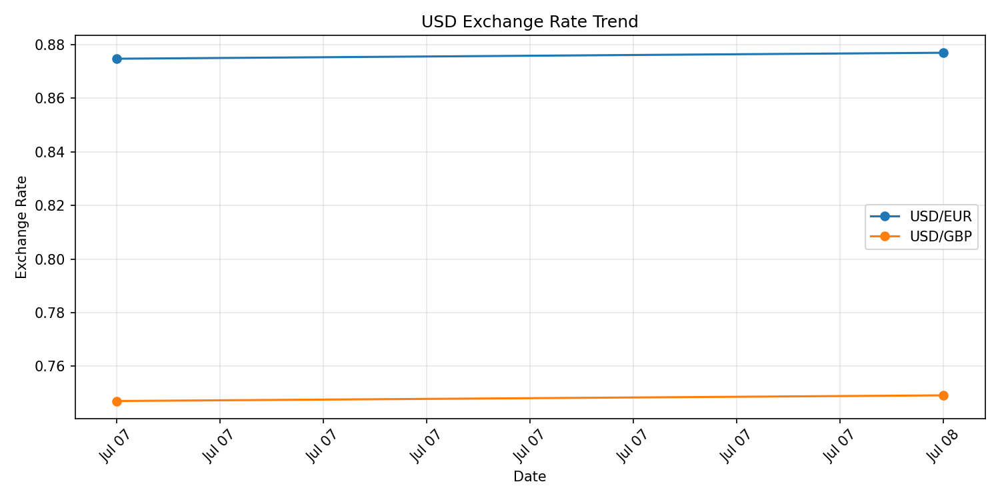
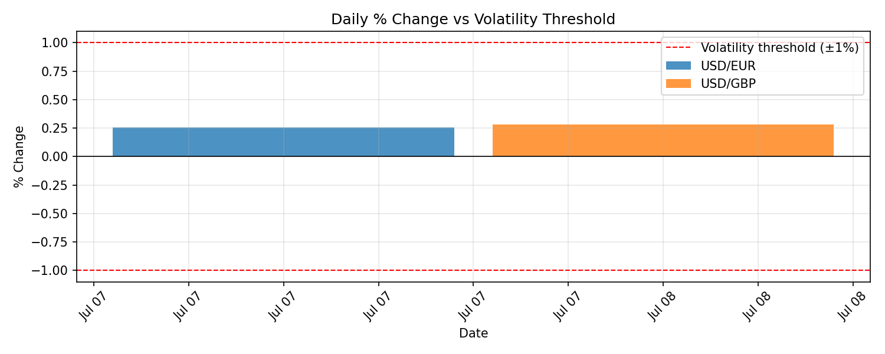

# Currency Exchange Rate ETL Pipeline

An automated ETL pipeline that extracts daily USD exchange rates, transforms them into a clean historical dataset, loads them into SQLite, and runs unattended on a daily schedule via GitHub Actions.



## Problem Statement

Businesses and individuals dealing with cross-border transactions, international payments, or relocation planning need to track currency movements over time — but exchange rate data from public APIs is only available as point-in-time snapshots. There's no persistent, queryable history unless you build one yourself, and manually checking rates daily doesn't scale. Sudden currency volatility (e.g. a >1% single-day swing) can also go unnoticed until it's already affected a transaction or budget decision.

Raw exchange rate data exists, but it isn't being captured, structured, or monitored over time in a way that supports trend analysis or timely decision-making.

## Solution

This pipeline:

1. **Extracts** daily USD → EUR/GBP/PKR exchange rates from the [Frankfurter API](https://frankfurter.dev), preserving raw API responses for auditability
2. **Transforms** raw data into a clean, structured format — deduplicating same-day collections, calculating day-over-day % change, and explicitly logging (not silently dropping) missing currency data
3. **Loads** structured data into SQLite with a proper schema and upsert logic, so historical trends can be queried directly rather than recomputed
4. **Automates** the entire process to run daily via GitHub Actions, with retry logic and error handling — the dataset grows on its own with no manual intervention
5. **Surfaces insight** through visualizations showing rate trends and flagging volatility events (>1% single-day moves)

## Architecture

```
                 ┌─────────────────────┐
                 │   Frankfurter API    │
                 │  (public, no auth)   │
                 └──────────┬───────────┘
                             │
                    fetch_rates_with_retry()
                    (3 retries, exponential backoff)
                             │
                             ▼
                 ┌─────────────────────┐
                 │   data/raw/*.json    │   ◄── bronze layer
                 │  (untouched, one     │       (raw, auditable,
                 │   file per run)      │        never overwritten)
                 └──────────┬───────────┘
                             │
                    flatten_all_records()
                    dedupe_by_date()
                    add_pct_change()
                             │
                             ▼
                 ┌─────────────────────┐
                 │  SQLite (upsert)     │   ◄── silver layer
                 │  exchange_rates      │       (clean, queryable,
                 │  table               │        idempotent)
                 └──────────┬───────────┘
                             │
                    matplotlib / pandas
                             │
                             ▼
                 ┌─────────────────────┐
                 │  Trend & volatility  │   ◄── presentation layer
                 │  charts (PNG)        │
                 └─────────────────────┘

Scheduling: GitHub Actions (cron: daily) → runs run_pipeline.py
             → commits updated data/ back to the repo
```

## Tech Stack

- **Python** — requests, pandas, numpy, matplotlib
- **SQLite** — lightweight relational storage, schema with composite primary key
- **GitHub Actions** — CI/CD scheduling (cron + manual dispatch)
- **Frankfurter API** — free, no-auth exchange rate data (ECB-sourced)

## Project Structure

```
currency-etl/
├── .github/workflows/
│   └── daily-pipeline.yml     # scheduled automation
├── data/
│   ├── raw/                   # bronze layer: raw API snapshots (JSON)
│   ├── currency_rates.db      # silver layer: clean SQLite table
│   ├── rate_trend.png
│   └── volatility_chart.png
├── src/
│   ├── extract.py             # API extraction, retry logic, raw persistence
│   └── transform_load.py      # cleaning, dedup, pct_change, SQLite load
├── run_pipeline.py            # single entry point: extract → transform → load
└── 01_extraction.ipynb        # development/demo notebook
```

## Key Engineering Decisions

**Raw data is never overwritten.** Every API response is saved as a timestamped JSON file before any transformation. If a transformation bug is found later, it can be re-run against the original data without needing to re-hit the API.

**Missing data is logged, not estimated.** Frankfurter's free tier occasionally omits PKR from multi-currency responses. Rather than forward-filling or guessing a rate, missing currency-date pairs are simply left absent from the dataset and explicitly logged. Every row in the final table reflects an actual API-confirmed rate — nothing is fabricated.

**Deduplication before metric calculation.** Early testing produced multiple same-day collections, which would have distorted `pct_change` into a collection-over-collection metric instead of a true day-over-day one. `dedupe_by_date()` keeps only the latest collection per calendar date before computing change, so the metric is always genuinely daily.

**Idempotent loads.** The SQLite table uses a composite primary key (`date`, `base_currency`, `target_currency`) with `INSERT OR REPLACE`, so re-running the pipeline — whether by accident or design — never produces duplicate rows.

## Bugs Found & Fixed

- **CI `IndentationError`**: an early version of the GitHub Actions workflow inlined the pipeline as a multi-line `python -c "..."` string in YAML. Whitespace handling between YAML and Python's indentation rules conflicted, breaking the script silently in CI while working locally. Fixed by extracting the logic into a standalone `run_pipeline.py` script — more robust, and independently testable.
- **GitHub Actions `403` on push**: the workflow's default token had read-only repo access, so the automated "commit updated data" step failed. Fixed by explicitly declaring `permissions: contents: write` in the workflow file.
- **Data gap investigation**: a short gap appeared in the collected dataset (a day or two missing). Traced to [confirm: weekend/FX market closure, or a missed Actions run — fill in once you check], and documented rather than papered over.

## Results

After ~10 days of automated daily collection:



- Rate history for USD/EUR and USD/GBP is now fully queryable, with day-over-day % change computed automatically
- No volatility alerts (>1% single-day moves) were triggered during the collection window — both currencies stayed within a stable ±0.5% daily band
- The pipeline has run unattended via GitHub Actions with no manual intervention since deployment

## What I'd Improve at Production Scale

- Swap SQLite for Postgres to support concurrent writes and larger volume
- Add a dedicated alerting channel (email/Slack) when a volatility threshold is crossed, instead of just logging it
- Backfill PKR from a secondary data source to close the currency gap
- Add automated tests (pytest) for the transform functions rather than relying on manual notebook verification
- Add dbt or Great Expectations for formal data quality checks as the schema grows

## Running It Locally

```bash
git clone https://github.com/DaniyalAtiq9/currency-etl.git
cd currency-etl
pip install requests pandas numpy matplotlib
python run_pipeline.py
```

## Author

Daniyal Atiq — [Upwork profile] · [LinkedIn]
